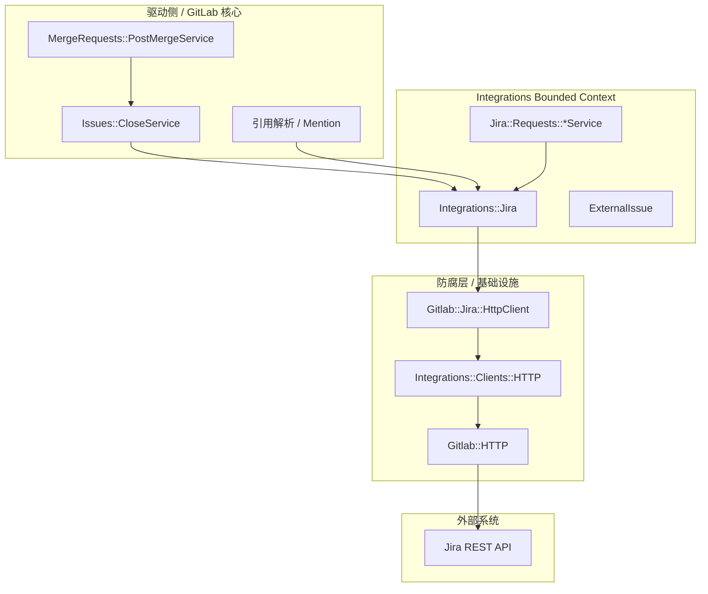

> 分析基于 GitLab 开源代码库（`gitlab-org/gitlab`），路径以仓库根为准。  
> 分析日期：2026-06-01（增补 `lib/gitlab/` 与 `HttpClient` 专节：2026-06-01）

## 1. 为何选 Jira 集成作为样本

GitLab 与外部系统的交互方式很多（Webhooks 出站、REST/GraphQL 入站、OAuth、Bulk Import、Registry 等）。**Jira 集成**同时具备以下特征，适合作为「教科书级」样本：

| 特征 | 说明 |
|------|------|
| **双向语义** | GitLab 主动调 Jira REST API；MR/Commit 文本中引用 Jira Key 触发回写 |
| **出站 HTTP** | 经 `Gitlab::HTTP` / `Integrations::Clients::HTTP`，有 URL 校验与响应大小限制 |
| **领域边界清晰** | 在 `config/bounded_contexts.yml` 中注册为 **`Integrations`** Context |
| **插件化扩展** | 与 Redmine、YouTrack 等共享 `IssueTracker` 抽象，不污染 `Issuables::` 核心 |
| **防腐层** | `Gitlab::Jira::HttpClient` 替换 `jira-ruby` 默认客户端 |

下文从 **DDD 战略/战术**、**六边形端口适配**、**内聚/耦合** 三个角度拆解实现。

---

## 2. 总体架构（一图）



**读图要点**：

- **Merge Request / Issue 用例**（`MergeRequests::`、`Issues::`）不直接 `HTTParty.get` Jira，而是依赖 `project.external_issue_tracker` 多态接口。
- **Jira 专有协议** 收敛在 `Integrations::Jira` + `Jira::Requests::*` + `Gitlab::Jira::HttpClient`。
- 跨 Context 的「接头」是 **`ExternalIssue`** 与 **`Integration` STI**，而不是把 Jira JSON 塞进 `Issue` 模型。

---

## 3. Bounded Context 与通用语言

### 3.1 战略划分

`config/bounded_contexts.yml`：

```yaml
Integrations:
  description: Integrate GitLab with external tools and platforms
  feature_categories:
    - integrations
```

`Issuables::` / `WorkItems::` 负责 **GitLab 内部** 的 Issue/MR 生命周期；**外部 Issue Tracker** 属于 `Integrations::`，避免在 `app/models/issue.rb` 里散落 `if jira?` 分支。这与官方设计一致：

> Feature specific behavior must not go here.（`Projects::` 只负责 workspace 生命周期）

### 3.2 通用语言（Ubiquitous Language）

| 产品/文档用语 | 代码体现 |
|---------------|----------|
| Jira issues 集成 | `Integrations::Jira`（`Integration` 子类，STI `type_new`） |
| 外部议题 | `ExternalIssue`（非 AR，仅承载 Jira Key 如 `PROJ-123`） |
| 交叉引用 / Remote link | `create_cross_reference_note` |
| MR 合并关闭 Jira | `close_issue` + `Issues::CloseService#close_external_issue` |
| 连接测试 | `test` / `valid_connection?` |

GitLab 刻意用 **`ExternalIssue`** 而不是把 Jira ticket 建成 `issues` 表记录，表明 **外部 Aggregate 不在 GitLab DB 内**——这是典型的 **集成上下文 vs 核心领域** 分界。

---

## 4. 高内聚：什么聚在一起

### 4.1 集成配置与行为：`Integrations::Jira`

路径：`app/models/integrations/jira.rb`

**高内聚点**（同一类内聚）：

- 连接字段（`url`、`api_url`、认证类型）、校验规则
- Jira REST 路径常量 `API_ENDPOINTS`
- 对外能力：`find_issue`、`close_issue`、`create_cross_reference_note`、`client`
- Jira Cloud / Server 差异（`valid_jira_cloud_url?`、认证方式枚举）

```ruby
# app/models/integrations/jira.rb（节选）
API_ENDPOINTS = {
  find_issue: "/rest/api/2/issue/%s",
  transition_issue: "/rest/api/2/issue/%s/transitions",
  # ...
}.freeze

def client(additional_options = {})
  JIRA::Client.new(options.merge(additional_options)).tap do |client|
    client.request_client = Gitlab::Jira::HttpClient.new(client.options)
  end
end
```

**说明**：在 Rails 单体里，「集成」常被建模为一个 **胖 ActiveRecord + 领域行为** 的混合体；内聚的是 **「如何连 Jira、如何调 Jira API」**，而不是整个 GitLab 合并流程。

### 4.2 Issue Tracker 横切：`Integrations::Base::IssueTracker`

路径：`app/models/concerns/integrations/base/issue_tracker.rb`

多个外部 Tracker（Jira、Redmine、YouTrack…）共享：

- `reference_pattern`（从 commit/MR 文本提取 `PROJ-123`）
- `issue_url` / `data_fields` 结构
- 「每项目仅一个 issue tracker」校验

这是 **按能力（Capability）内聚**，而非按第三方产品内聚——符合 **接口隔离**：核心只依赖 `external_issue_tracker` 的能力，不依赖 Jira 类名。

### 4.3 只读列表查询：`Jira::Requests::*`

路径：`app/services/jira/requests/`

| 类 | 职责 |
|----|------|
| `Jira::Requests::Base` | 统一错误映射、`ServiceResponse`、连接前置检查 |
| `Issues::ListService` | JQL 列表（模板方法，Cloud/Server 子类实现） |
| `Projects::ListService` | Jira 项目列表 |

```ruby
# app/services/jira/requests/base.rb（节选）
def execute
  return ServiceResponse.error(message: _('Jira service not configured.')) unless jira_integration&.active?
  request
end

def request
  response = client.get(url)
  build_service_response(response)
rescue *ALL_ERRORS => error
  ServiceResponse.error(message: error_message(error))
end
```

**内聚**：HTTP 错误 → 用户可读文案 → 文档链接，全部在 Request Service 层完成，不泄漏到 Controller/GraphQL。

### 4.4 HTTP 出站栈

```
Integrations::Jira#client
  → JIRA::Client (gem)
    → Gitlab::Jira::HttpClient (防腐)
      → Integrations::Clients::HTTP
        → Gitlab::HTTP (URL 阻断、超时、响应大小)
```

`lib/gitlab/jira/http_client.rb` 中显式使用 `Integrations::Clients::HTTP`，保证集成出站与全局安全策略一致。

---

## 5. 低耦合：如何与核心领域分开

### 5.1 依赖方向（核心不依赖 Jira 实现）

**合并 MR 关闭议题**（简化调用链）：

```
MergeRequests::PostMergeService#close_issues
  → Issues::CloseService#execute (ExternalIssue 分支)
    → project.external_issue_tracker.close_issue(...)
      → Integrations::Jira#close_issue
```

```ruby
# app/services/issues/close_service.rb（节选）
def close_external_issue(issue, closed_via)
  return unless project.external_issue_tracker&.support_close_issue?

  project.external_issue_tracker.close_issue(closed_via, issue, current_user)
end
```

**耦合形态**：

| 层级 | 知道什么 | 不知道什么 |
|------|----------|------------|
| `Issues::CloseService` | 存在 `external_issue_tracker`，可 `close_issue` | Jira transition API、Basic/PAT 认证 |
| `MergeRequests::PostMergeService` | `has_external_issue_tracker?` | `Integrations::Jira` 类名 |
| `Integrations::Jira` | Jira REST、workflow | GitLab `Issue` 表结构 |

这是 **依赖倒置** 的实用版：核心依赖 **`Integration` 多态接口**（`support_close_issue?`、`close_issue`），而非 Jira gem。

### 5.2 `ExternalIssue`：边界对象（Boundary Object）

```ruby
# app/models/external_issue.rb（节选）
class ExternalIssue
  attr_reader :project

  def initialize(issue_identifier, project)
    @issue_identifier = issue_identifier
    @project = project
  end

  def web_url
    tracker = project.external_issue_tracker
    URI.parse(tracker.issue_url(id)).to_s
  end
end
```

- **无持久化**：外部议题状态以 Jira 为准。
- **在 GitLab 内统一 Referable**：MR 描述、提交信息可像 `#123` 一样引用 `JIRA-1`。
- **关闭路径与内部 Issue 分流**：`PostMergeService` 对 `Issue` 走异步 Worker，对 `ExternalIssue` **同步**调 `CloseService`（注释写明 Worker 只支持 AR Issue）。

### 5.3 防腐层（Anti-Corruption Layer）

| 组件 | 作用 |
|------|------|
| `Gitlab::Jira::HttpClient` | 替换 `jira-ruby` 默认 Net::HTTP，统一走 GitLab 安全 HTTP |
| `ServiceResponse` | 对外 API/UI 返回成功/失败载荷，不向上抛 `JIRA::HTTPError` |
| `jira_request` 包装 | 在 `Integrations::Jira` 内捕获异常、记日志，避免污染调用栈 |

```ruby
# lib/gitlab/jira/http_client.rb（节选）
result = Integrations::Clients::HTTP.public_send(http_method, path, **request_params)
```

外部模型（`JIRA::Resource::Issue`）**不进入** `Issuables::`；仅在 Integrations / Jira::Requests 边界内使用。

### 5.4 与 Webhooks 的对比（另一种集成风格）

| 维度 | Jira 集成 | Project Webhook |
|------|-----------|-----------------|
| 方向 | GitLab → Jira（拉/推 API） | GitLab → 用户 URL（POST JSON） |
| 配置 | `Integrations::Jira` + credentials | `ProjectHook` URL |
| 编排 | 领域事件驱动（合并、mention） | `WebHookService` 通用投递 |
| 耦合 | 强类型 Jira 客户端 | 弱类型 JSON payload |

Webhooks **极低耦合、极高通用性**；Jira **较高类型耦合、较强业务语义**。两者同属 `Integrations` Context，但 ** cohesion/coupling 权衡不同**。

### 5.5 深入：`lib/gitlab/` 为何用项目名？`HttpClient` 为何单独成文件？

读 Jira 集成时常见两个疑问：**为什么共享库放在 `lib/gitlab/`（项目名）下？** 以及 **为什么 `Gitlab::Jira::HttpClient` 不写在 `app/models/integrations/jira.rb` 里？** 本节把目录布局与防腐层设计连在一起说明。

#### 5.5.1 `lib/gitlab/` 不是装饰，而是 Ruby 根模块 `Gitlab::`

在 Ruby/Rails 中，**目录路径与常量命名空间一一对应**（Zeitwerk 自动加载）：

```
lib/gitlab/jira/http_client.rb  →  Gitlab::Jira::HttpClient
```

应用根模块在 `config/application.rb` 中即为 `module Gitlab`，因此海量共享代码集中在 `lib/gitlab/` 下，表示 **整款产品的「姓氏」**，而不是某个 feature 的子目录。

| 原因 | 说明 |
|------|------|
| **避免全局污染** | 使用 `Gitlab::Jira::HttpClient`，不与其它 gem/项目的 `HttpClient` 冲突 |
| **与 `app/` 分工** | `app/`：Rails 惯用结构（models、services、controllers）；`lib/gitlab/`：`Gitlab::` 下的工具、适配器、后台迁移等 |
| **与其它 `lib/` 并列** | 如 `lib/integrations/`（集成出站 HTTP 封装）、`lib/gitaly/`（Gitaly 客户端）按子系统再分子域；`lib/gitlab/` 是产品级根 |

官方 [Software design guides](https://docs.gitlab.com/ee/development/software_design.html) 将 `lib` 中一部分称为 **infrastructure layer**：偏通用、理论上可抽成 gem 的代码。`Gitlab::Jira::HttpClient` 属于 **传输适配**，不是「Jira 集成业务」本身。

**`lib/gitlab/` 主要隔开的是：**

1. **`app/`（Rails 领域/用例）** — 业务编排不直接写裸 `Net::HTTP`
2. **第三方 gem（`jira-ruby`）** — 仍用 `JIRA::Client` API，但替换其默认 HTTP 实现
3. **其它 `lib/` 兄弟目录** — 职责按子系统拆分，避免全部堆在顶层 `lib/`

#### 5.5.2 三层目录 + 一个独立文件各管什么

```
app/models/integrations/jira.rb     ← 产品：「Jira 集成」配置与行为（Integrations Context）
        │
        │  client.request_client = Gitlab::Jira::HttpClient.new(...)
        ▼
lib/gitlab/jira/http_client.rb      ← 技术：替换 jira-ruby 的 HTTP，走 GitLab 安全栈
        │
        ▼
lib/integrations/clients/http.rb    ← 集成出站 HTTP 封装（响应大小限制等）
        │
        ▼
gems/gitlab-http → Gitlab::HTTP     ← URL 阻断、超时、全局限流
```

| 层级 | 命名空间 | 隔离对象 |
|------|----------|----------|
| 集成业务 | `Integrations::Jira` | 关 issue、交叉引用、表单、与 `Project` 关系 |
| HTTP 适配 | `Gitlab::Jira::HttpClient` | `jira-ruby` 默认 `Net::HTTP` ↔ `Gitlab::HTTP` |
| 用例查询 | `Jira::Requests::*`（`app/services/jira/`） | 列表/JQL、`ServiceResponse`、用户可见错误文案 |

**为何不放在 `app/services/jira/requests/`？**  
`Jira::Requests::*` 是 **用例层**（读 issue 列表、拼错误信息），仍通过 `jira_integration.client` 间接使用 HttpClient。  
`HttpClient` 更底层，是 **对 `JIRA::HttpClient` 的子类替换**，放在 `lib/gitlab/jira/` 符合「基础设施适配器」的定位。

#### 5.5.3 `HttpClient` 单独成文件隔开了什么

```ruby
# app/models/integrations/jira.rb — 只注入，不实现 HTTP
def client(additional_options = {})
  JIRA::Client.new(options.merge(additional_options)).tap do |client|
    client.request_client = Gitlab::Jira::HttpClient.new(client.options)
  end
end
```

```ruby
# lib/gitlab/jira/http_client.rb — 继承 gem，改走 Gitlab 安全 HTTP
class HttpClient < JIRA::HttpClient
  def make_request(http_method, path, body = '', headers = {})
    # ...
    result = Integrations::Clients::HTTP.public_send(http_method, path, **request_params)
    # ...
  end
end
```

| 被隔离的一方 | 若不单独拆文件 |
|--------------|----------------|
| **`jira-ruby` 默认 HTTP** | 可能绕过 SSRF 防护、统一超时、响应体大小限制 |
| **`Integrations::Jira` 胖模型** | 800+ 行再叠 HTTP/cookie/超时逻辑，难读难测 |
| **Jira 协议 vs GitLab 安全策略** | 第三方客户端行为与运维/安全要求不一致 |

**单独文件带来的收益：**

- **可单独测试**：`spec/lib/gitlab/jira/` 只测传输层，不必加载完整 Integration AR
- **可复用**：除 `Integrations::Jira#client` 外，EE 后台迁移等也会注入同一 `HttpClient`
- **依赖方向清晰**：`lib/gitlab` → `Integrations::Clients::HTTP` → `Gitlab::HTTP`；业务模型只「换引擎」，不实现引擎
- **懒加载粒度**：仅创建 Jira client 时加载该类

同目录还有 `lib/gitlab/jira/dvcs.rb`（Jira DVCS 路径编码等），说明 **`lib/gitlab/jira/` 收拢「与 Jira 协议相关、但不属于 Integration AR」的库代码**，而不是散落在 `app/models`。

#### 5.5.4 与 `Integrations::Jira` 的命名分工（易混点）

| 类/模块 | 路径 | 职责 |
|---------|------|------|
| `Integrations::Jira` | `app/models/integrations/jira.rb` | Bounded Context **Integrations**：配置、行为、多态接口 |
| `Gitlab::Jira::HttpClient` | `lib/gitlab/jira/http_client.rb` | **防腐层**：安全 HTTP + 满足 `jira-ruby` 插件接口 |
| `Jira::Requests::Base` | `app/services/jira/requests/base.rb` | 用例级请求与错误翻译 |

`Issues::CloseService`、`ExternalIssue` **不需要** `require` HttpClient；只有 `JIRA::Client` 构造时注入——这正是 **把第三方 HTTP 挡在 `lib/gitlab/` 边界内**。

#### 5.5.5 小结（两句）

1. **为什么用 `gitlab` 做文件夹名？** — 因为根模块是 `Gitlab::`，Zeitwerk 要求 `lib/gitlab/...` 对应 `Gitlab::...`，用于组织产品级共享库并与 `app/`、其它 `lib/*` 区分。  
2. **为什么要单独文件？** — 它是 `jira-ruby` 的 HTTP 适配器，职责与集成业务不同；独立文件便于复用、测试，并强制所有 Jira 出站请求走 GitLab 统一安全 HTTP 栈。

---

## 6. DDD 战术模式对照

| DDD 概念 | Jira 集成中的实现 | 评价 |
|----------|-------------------|------|
| **Bounded Context** | `Integrations::` 命名空间 + RuboCop `bounded_contexts.yml` | 明确 |
| **Entity** | `Integrations::Jira`（AR，挂载 `JiraTrackerData`） | 配置 + 行为混合 |
| **Value Object** | `ExternalIssue`、认证类型枚举、JQL 参数 | 轻量 PORO / enum |
| **Domain Service** | `Integrations::Jira#close_issue`、`Jira::Requests::*` | 编排与协议分离不均 |
| **ACL** | `Gitlab::Jira::HttpClient`、`ServiceResponse` | 清晰 |
| **Domain Event** | 无独立 `JiraIssueClosedEvent`；由 MR/Issue 流程同步调用 | 偏命令式，非事件驱动 |
| **Repository** | 无 Jira Issue 仓储；`find_issue` 即远程查询 | 符合「数据在域外」 |

GitLab **没有**单独的 `domain/integrations/jira/` 目录，而是用 **Rails 惯例 + 命名空间** 表达 DDD——与 [Project 领域对象分析]() 一致。

---

## 7. 六边形架构映射

| 六边形角色 | Jira 相关实现 |
|------------|---------------|
| **Primary Adapter** | GraphQL `jira_projects`、设置页 Integration 表单、`MergeRequests::PostMergeService` |
| **Application Core** | `Issues::CloseService`、`Integrations::Jira` 业务方法 |
| **Secondary Adapter** | `Gitlab::Jira::HttpClient` → Jira REST |
| **Port（隐式）** | `external_issue_tracker`、`support_close_issue?`、`create_cross_reference_note` |

核心 **不 import** `JIRA::Client`；仅在 `Integrations::Jira` 适配器内实例化——符合 [六边形架构实践]() 中的「出站适配器」。

---

## 8. 端到端用例：MR 合并关闭 Jira Issue

**触发条件**：MR 合并到默认分支，描述或提交信息含 `Closes PROJ-123` 等，且项目启用 Jira 为 external tracker。

```
1. MergeRequests::PostMergeService#execute
2. close_issues → merge_request.closes_issues
3. issue 为 ExternalIssue → Issues::CloseService#execute
4. close_external_issue → Integrations::Jira#close_issue
5. find_issue → transition_issue → add_issue_solved_comment（若 workflow 允许）
6. HTTP: PUT/POST Jira REST transitions API
```

```ruby
# app/models/integrations/jira.rb（节选）
def close_issue(entity, external_issue, current_user)
  issue = find_issue(external_issue.iid, transitions: jira_issue_transition_automatic)
  return if issue.nil? || has_resolution?(issue) || !issue_transition_enabled?

  commit_url = build_entity_url(:commit, commit_id)
  issue = find_issue(issue.key) if transition_issue(issue)
  add_issue_solved_comment(issue, commit_id, commit_url) if has_resolution?(issue)
end
```

**内聚**：关闭语义（transition + comment）在 Jira 集成内一次完成。  
**耦合**：`Issues::CloseService` 仅多态调用，不知 transition id 配置字段名。

---

## 9. 设计权衡与可改进点（批判性阅读）

### 9.1 胖模型 `Integrations::Jira`

单文件 800+ 行，混合：表单 field 定义、校验、REST 调用、评论模板、Cloud 检测。  
**内聚过高到「上帝类」风险**——维护成本高，但 **对运维/产品来说配置与行为同屏**，符合 Rails Integration STI 历史。

可演进方向（GitLab 已在部分场景实践）：

- 将 **只读查询** 留在 `Jira::Requests::*`（已做）
- 将 **写操作**（transition、comment）拆为 `Jira::Issues::CloseService` 等小型 Service
- Webhook 式 **异步 Worker** 用于慢 Jira 实例（外部 Issue 目前多同步）

### 9.2 `execute(push)` 空实现

```ruby
def execute(push)
  # This method is a no-op, because currently Integrations::Jira does not
  # support any events.
end
```

Jira 交叉引用走 **引用解析 / Mention 管道**，而非 Integration 的 `push` 事件钩子——说明 **同一 Context 内也有多条触发路径**，读代码时需追 `create_cross_reference_note` 调用方，而非只看 `supported_events`。

### 9.3 同步 vs 异步

内部 `Issue` 关闭用 `MergeRequests::CloseIssueWorker` 防 SQL 超时；`ExternalIssue` **同步**调 Jira。  
**耦合了可用性**：Jira 慢会拖慢 MR 合并后处理——这是明确的 **一致性优先**  trade-off。

---

## 10. 可复用的设计原则（读后 checklist）

1. **为外部系统单独划 Context**（`Integrations::`），不要把第三方 API 字段塞进核心 `Issue`。
2. **用边界类型表示外部引用**（`ExternalIssue`），用多态 `Integration` 抽象多种 Tracker。
3. **所有出站 HTTP 走统一网关**（`Gitlab::HTTP` + URL blocker），集成代码不裸用 `Net::HTTP`。
4. **防腐层包裹第三方 SDK**（`Gitlab::Jira::HttpClient`），便于换 gem 或加观测。
5. **用例层只问能力**（`support_close_issue?`），不问具体类名。
6. **错误在边界翻译**（`Jira::Requests::Base#error_message`），核心与 UI 不见 `JIRA::HTTPError`。
7. **根据一致性需求选择同步/异步**；外部 Issue 与内部 Issue 路径刻意不同。
8. **传输适配放 `lib/gitlab/`**（如 `Gitlab::Jira::HttpClient`），集成业务放 `app/models/integrations/`，用例查询放 `app/services/jira/`。

---

## 11. 关键文件索引

| 路径 | 职责 |
|------|------|
| `app/models/integrations/jira.rb` | Jira 集成实体 + 主要对外 API |
| `app/models/external_issue.rb` | 外部议题边界对象 |
| `app/models/concerns/integrations/base/issue_tracker.rb` | Issue Tracker 共享行为 |
| `app/services/jira/requests/base.rb` | Jira 只读请求与错误处理 |
| `app/services/issues/close_service.rb` | 关闭内部/外部议题编排 |
| `app/services/merge_requests/post_merge_service.rb` | MR 合并后关闭议题 |
| `lib/gitlab/jira/http_client.rb` | Jira HTTP 防腐层（替换 `jira-ruby` 默认客户端） |
| `lib/gitlab/jira/dvcs.rb` | Jira DVCS 路径编码等库代码（同子域复用） |
| `lib/integrations/clients/http.rb` | 集成专用 HTTP 封装 |
| `lib/gitlab/http.rb` | 全局安全 HTTP（URL 阻断、超时、响应大小） |
| `config/bounded_contexts.yml` | `Integrations` Context 注册 |
| `config/application.rb` | 根模块 `module Gitlab` 定义 |
| `doc/user/project/integrations/_index.md` | 用户向集成列表 |

---

## 12. 小结

GitLab 与 Jira 的交互 **不是** 在控制器里直接 `HTTParty.post`，而是通过：

- **战略**：`Integrations` Bounded Context；
- **战术**：`ExternalIssue` 边界对象、`Integration` 多态、`Jira::Requests` 查询服务；
- **基础设施**：`lib/gitlab/jira/HttpClient` 防腐层（`Gitlab::` 根模块 + 独立文件，与 `Integrations::Jira` 业务分离）；
- **用例编排**：`Issues::CloseService` / `MergeRequests::PostMergeService` 依赖能力接口。

整体上实现了 **「Jira 细节向内聚、GitLab 核心向外松耦合」**；目录上体现为 **`app/` 管集成业务、`lib/gitlab/` 管产品级适配与工具**；代价是 `Integrations::Jira` 体量较大，以及外部议题关闭路径与内部 Issue 的同步/异步分裂。若要分析其他出站集成，可对照本文结构查看 **Webhook（通用 JSON）**、**Slack（OAuth + API）**、**Bulk Import（实例间 HTTP）** 的 cohesion/coupling 差异。

---

## 参考

- GitLab 仓库：`https://gitlab.com/gitlab-org/gitlab`
- 用户文档：[Project integrations](https://docs.gitlab.com/ee/user/project/integrations/)
- 开发文档：[Software design guides](https://docs.gitlab.com/ee/development/software_design.html)（Bounded Context、Ubiquitous Language）
- 本系列：[GitLab 中的 DDD 概念与 Project 示例]() · [六边形架构在 GitLab 中的实践]()
