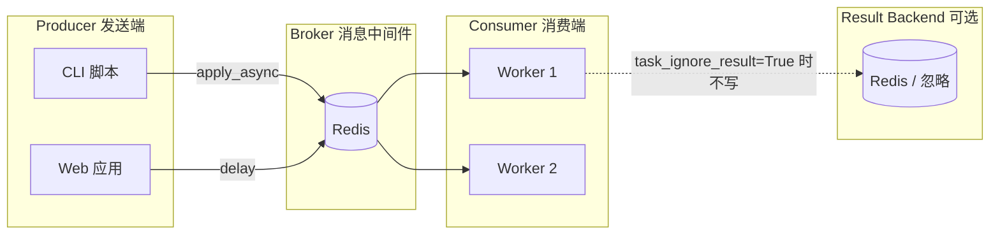
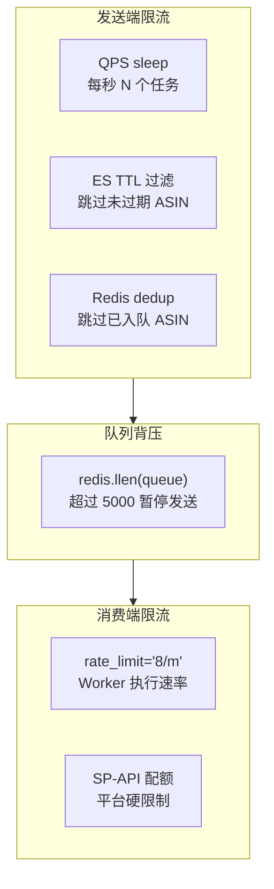

> 本文基于 [em-celery](https://github.com/VG-IT/em-celery) 生产项目总结。该项目用 Celery + Redis 在 Google VPS 上处理 Amazon SP-API 报价更新、商品目录同步、Shopify 产品上传等异步任务，日处理量可达数十万 ASIN。

## 目录

1. [Celery 是什么](#1-celery-是什么)
2. [核心架构](#2-核心架构)
3. [最小可运行示例](#3-最小可运行示例)
4. [em-celery 项目结构](#4-em-celery-项目结构)
5. [定义任务](#5-定义任务)
6. [发送任务](#6-发送任务)
7. [消费任务（Worker）](#7-消费任务worker)
8. [队列与路由](#8-队列与路由)
9. [配置详解](#9-配置详解)
10. [错误处理与重试](#10-错误处理与重试)
11. [限流与背压控制](#11-限流与背压控制)
12. [生产部署](#12-生产部署)
13. [监控与排障](#13-监控与排障)
14. [兼容升级策略](#14-兼容升级策略)
15. [常见坑与最佳实践](#15-常见坑与最佳实践)

---

## 1. Celery 是什么

Celery 是 Python 生态中最流行的**分布式任务队列**框架。它解决的核心问题：

- **解耦**：发送方（脚本、Web 服务）不需要等待耗时操作完成
- **削峰**：突发流量写入队列，Worker 按能力匀速消费
- **水平扩展**：多台 Worker 并行处理同一队列
- **可靠性**：消息持久化、延迟确认、失败重试

典型场景：发邮件、生成报表、调用第三方 API、图片处理、数据同步——任何可以异步执行的逻辑。

---

## 2. 核心架构



| 组件 | 职责 | em-celery 中的实现 |
|------|------|-------------------|
| **Producer** | 创建任务消息并入队 | `em_celery/tools/*_task_sender.py` |
| **Broker** | 存储待执行消息 | Redis `redis://host:6379/2` |
| **Worker** | 从队列取消息并执行 | Google VPS 上的 `celery worker` |
| **Result Backend** | 存储任务返回值 | 未使用（`task_ignore_result = True`） |

---

## 3. 最小可运行示例

### 3.1 安装

```bash
pip install celery redis
```

### 3.2 定义 App 和任务

```python
# tasks.py
from celery import Celery

app = Celery("demo", broker="redis://localhost:6379/0")
app.config_from_object("celeryconfig")  # 可选


@app.task
def add(x, y):
    return x + y
```

### 3.3 发送任务

```python
# sender.py
from tasks import add

# 方式一：delay（语法糖）
result = add.delay(4, 6)

# 方式二：apply_async（更多控制）
result = add.apply_async(args=(4, 6), queue="math")
```

### 3.4 启动 Worker

```bash
celery -A tasks worker --loglevel=info -Q math
```

> **要点**：Producer 和 Worker 可以运行在不同机器上，只要连同一个 Broker URL。

---

## 4. em-celery 项目结构

em-celery 采用**两层分离**设计，这是大型 Celery 项目的推荐模式：

```
em-celery/
├── em_celery/
│   ├── worker.py          # Celery App 入口，自动发现任务
│   ├── config.py          # Celery 全局配置
│   ├── __init__.py        # 配置加载、服务工厂（ES、Mongo、SP-API）
│   ├── tasks/             # 薄 Celery 包装层（@app.task）
│   │   ├── base.py        # BaseTask：懒加载依赖
│   │   ├── spapi_update_item_offers_task.py
│   │   ├── spapi_update_catalog_items_task.py
│   │   └── shopify_upload_product_task.py
│   └── tools/             # 发送端 CLI 工具
│       ├── spapi_update_item_offers_task_sender.py
│       └── spree/amz_offers_update_task_sender.py
└── em-tasks/              # 业务逻辑包（与 Celery 解耦）
    └── em_tasks/tasks/    # SpapiUpdateItemOffersTask 等
```

**为什么要分层？**

| 层 | 文件 | 职责 |
|----|------|------|
| Celery 包装 | `em_celery/tasks/*.py` | 装饰器、限流、异常分类、重试策略 |
| 业务逻辑 | `em_tasks/tasks/*.py` | SP-API 调用、ES 写入、纯 Python |
| 发送工具 | `em_celery/tools/*.py` | 读数据源、过滤、批量、QPS、入队 |

好处：业务逻辑可以脱离 Celery 单独测试（`spapi_products_fetcher.py` 就是同步调用同一套逻辑）；升级 Celery 或换队列框架时，业务层不动。

---

## 5. 定义任务

### 5.1 App 自动发现

```python
# em_celery/worker.py
import pkgutil
from celery import Celery
import em_celery.tasks

modules = []
for loader, name, ispkg in pkgutil.iter_modules(em_celery.tasks.__path__):
    if ispkg:
        continue
    modules.append("em_celery.tasks.{}".format(name))

app = Celery("em_celery", include=modules)
app.config_from_object("em_celery.config")
```

新增任务文件放入 `em_celery/tasks/` 即可自动注册，无需手动 `include`。

### 5.2 任务装饰器

```python
# em_celery/tasks/spapi_update_item_offers_task.py
from em_celery.worker import app
from em_celery.tasks.base import BaseTask

@app.task(base=BaseTask, bind=True, acks_late=True, rate_limit="8/m")
def spapi_update_item_offers(self, marketplace, asins, condition="new",
                             ttl=24, force=False, callback=None):
    task = SpapiUpdateItemOffersTask(
        self.spapi, self.offer_service, marketplace, asins, condition
    )
    task.run()
```

| 参数 | 含义 |
|------|------|
| `base=BaseTask` | 自定义 Task 基类，注入 SP-API、ES 等服务 |
| `bind=True` | 第一个参数 `self` 是任务实例，可访问 `self.request` |
| `acks_late=True` | 任务执行成功后才 ack，崩溃可重新入队 |
| `rate_limit="8/m"` | 每个 Worker 进程每分钟最多执行 8 次 |

### 5.3 BaseTask：懒加载依赖

```python
# em_celery/tasks/base.py
class BaseTask(Task):
    _spapi = None
    _offer_service = None

    @property
    def spapi(self):
        if self._spapi is None:
            spapi_cfg = self.cfg["spapi"]
            self._spapi = Spapi({...})
        return self._spapi

    @property
    def offer_service(self):
        if self._offer_service is None:
            self._offer_service = get_offer_service()
        return self._offer_service
```

Worker 进程 fork 后，每个子进程各自懒初始化连接，避免在 master 进程建立无法 fork 的连接（数据库、HTTP 连接池）。

### 5.4 Worker 启动钩子

```python
# em_celery/worker.py
from celery.signals import worker_process_init

@worker_process_init.connect
def _ensure_indices_on_worker_fork(**kwargs):
    """每个 fork 子进程启动时执行一次"""
    ensure_item_offers_product_indices(get_product_service())
```

适合在 Worker 子进程内做索引创建、连接预热等一次性初始化。

---

## 6. 发送任务

em-celery 的发送端全部是独立 CLI 脚本，**不依赖 Worker 本地配置**，通过命令行传入 `broker_url`。

### 6.1 基本模式

```python
from kombu import Connection
from em_celery.tasks.spapi_update_item_offers_task import spapi_update_item_offers

broker_url = "redis://:password@34.133.1.247:6379/2"
connection = Connection(broker_url)
queue = "SpapiItemOffersUpdate_US"

spapi_update_item_offers.apply_async(
    args=("us", ["B00XXXXXX", "B01YYYYYY"], "new"),
    queue=queue,
    connection=connection,
)
```

**三个关键参数：**

- `args`：任务位置参数，必须与 `@app.task` 函数签名一致
- `queue`：目标队列名，Worker 按 `-Q` 订阅
- `connection`：显式 Broker 连接，发送端与 Worker 可不在同一环境

### 6.2 发送前过滤（TTL）

生产环境不会盲目发送所有 ASIN，而是先查 Elasticsearch 判断 offer 是否过期：

```python
now = datetime.datetime.utcnow()
offer_expire_time = now - datetime.timedelta(hours=ttl)

for asin in asins:
    offer = offers.get(asin)
    if not offer or offer_time < offer_expire_time:
        asins_without_offer.append(asin)  # 只发送需要更新的
```

这大幅减少了队列积压和 SP-API 配额消耗。

### 6.3 批量拆分

SP-API 每次请求最多 20 个 ASIN，发送端统一按 20 个一批拆分：

```python
chunks = [asins_without_offer[x:x + 20] for x in range(0, len(asins_without_offer), 20)]
for chunk in chunks:
    spapi_update_item_offers.apply_async(args=(marketplace, chunk, condition), ...)
```

### 6.4 QPS 限流

发送端自行控制入队速率，避免瞬间打满队列：

```python
if self.last_send_time:
    wait_time = 1 / self.qps - (time.time() - self.last_send_time)
    if wait_time > 0:
        time.sleep(wait_time)
self.last_send_time = time.time()
```

CLI 示例：

```bash
python -m em_celery.tools.spapi_update_item_offers_task_sender \
    -b "redis://:pass@host:6379/2" \
    -m us \
    -q 20 \
    asins.txt
```

`-q 20` 表示每秒发送 20 个任务（不是 20 个 ASIN，每个任务含 20 个 ASIN）。

### 6.5 delay vs apply_async

| 方法 | 场景 |
|------|------|
| `task.delay(*args)` | 简单调用，使用默认队列和默认 Broker |
| `task.apply_async(args=..., queue=..., connection=...)` | 生产环境：指定队列、Broker、ETA、重试次数等 |

em-celery 全部使用 `apply_async`，因为发送端与 Worker 分离部署。

### 6.6 apply_async 常用参数

```python
task.apply_async(
    args=(marketplace, asins),
    kwargs={"force": True},
    queue="SpapiItemOffersUpdate_US",
    connection=connection,
    countdown=60,          # 60 秒后执行
    expires=3600,          # 1 小时后过期丢弃
    retry=True,
    retry_policy={"max_retries": 3},
)
```

---

## 7. 消费任务（Worker）

### 7.1 启动命令

```bash
# 环境变量设置 Broker（Worker 端）
export BROKER_URL="redis://:password@localhost:6379/2"

# 启动 Worker，订阅指定队列
celery -A em_celery.worker worker \
    --loglevel=info \
    -Q SpapiItemOffersUpdate_US,SpapiItemOffersUpdate_UK \
    --concurrency=4
```

| 参数 | 说明 |
|------|------|
| `-A em_celery.worker` | Celery App 模块路径 |
| `-Q` | 订阅的队列列表，逗号分隔 |
| `--concurrency` | 并发进程数（prefork 模式） |
| `--loglevel` | 日志级别 |

### 7.2 多队列 Worker 分工

生产环境通常按 marketplace 或任务类型拆分 Worker：

```bash
# Worker A：只处理 US offer 更新
celery -A em_celery.worker worker -Q SpapiItemOffersUpdate_US --concurrency=2

# Worker B：处理 catalog 更新
celery -A em_celery.worker worker -Q SpapiCatalogItemsUpdate_US --concurrency=1

# Worker C：Shopify 上传
celery -A em_celery.worker worker -Q ShopifyProductUpload --concurrency=4
```

### 7.3 systemd 示例

```ini
# /etc/systemd/system/celery-offers-us.service
[Unit]
Description=Celery Worker - SP-API Offers US
After=network.target redis.service

[Service]
Type=forking
User=celery
Environment=BROKER_URL=redis://:password@127.0.0.1:6379/2
WorkingDirectory=/opt/em-celery
ExecStart=/opt/venv/bin/celery -A em_celery.worker worker \
    --loglevel=info \
    -Q SpapiItemOffersUpdate_US \
    --concurrency=2 \
    --pidfile=/var/run/celery/offers-us.pid \
    --logfile=/var/log/celery/offers-us.log \
    --detach
ExecStop=/bin/kill -TERM $MAINPID
Restart=always

[Install]
WantedBy=multi-user.target
```

---

## 8. 队列与路由

### 8.1 em-celery 队列命名约定

| 队列名 | 任务 | 说明 |
|--------|------|------|
| `SpapiItemOffersUpdate_{MARKET}` | `spapi_update_item_offers` | 按 marketplace 隔离 |
| `SpapiCatalogItemsUpdate_{MARKET}` | `spapi_update_catalog_items` | 商品目录 |
| `SpapiDownloadProducts_{MARKET}` | `spapi_download_products_task` | 下载产品信息 |
| `ShopifyProductUpload` | `upload_shopify_product` | Shopify 上传 |
| `ShopifyProductDelete` | `delete_shopify_product` | Shopify 删除 |

`{MARKET}` 为大写 marketplace 代码：`US`、`UK`、`DE`、`AE` 等。

### 8.2 硬编码 vs task_routes

em-celery 当前在发送端硬编码 `queue=` 参数：

```python
self.queue = "SpapiItemOffersUpdate_{}".format(marketplace.upper())
```

更现代的做法是在 `config.py` 中配置路由：

```python
# 可选演进方向
task_routes = {
    "em_celery.tasks.spapi_update_item_offers_task.spapi_update_item_offers": {
        "queue": "spapi_offers"  # 仍需发送端传 queue 覆盖 marketplace
    },
}
```

**升级注意**：队列名是 Producer 和 Worker 之间的契约，改名需要两端同步。

### 8.3 检查队列积压

发送端用 Redis `LLEN` 做背压控制：

```python
import redis

r = redis.Redis.from_url(broker_url)
queue_size = r.llen("SpapiItemOffersUpdate_US")

if queue_size > 5000:
    logger.info("Queue full, skip sending")
    return
```

---

## 9. 配置详解

```python
# em_celery/config.py
import os

# 不存储任务结果（fire-and-forget 模式）
task_ignore_result = True
task_store_errors_even_if_ignored = False
task_track_started = False

# 可靠性
task_acks_late = True              # 执行完才确认
task_reject_on_worker_lost = True  # Worker 丢失时重新入队
task_create_missing_queues = True  # 自动创建不存在的队列

# Broker
broker_url = os.getenv("BROKER_URL", "")

# 关闭事件（减少开销）
worker_send_task_events = False
task_send_sent_event = False
```

### 配置项说明

| 配置 | 推荐值 | 原因 |
|------|--------|------|
| `task_ignore_result` | `True` | 不需要查询任务返回值，减少 Redis 写入 |
| `task_acks_late` | `True` | 防止 Worker 崩溃导致任务丢失 |
| `task_reject_on_worker_lost` | `True` | 配合 acks_late，进程被 kill 时消息回队 |
| `task_create_missing_queues` | `True` | 新队列自动创建，省去手动声明 |

### 应用配置 vs 发送端配置

| 角色 | Broker 配置来源 |
|------|----------------|
| Worker | 环境变量 `BROKER_URL` 或 `config.py` |
| 发送端 CLI | 命令行 `-b broker_url` + `Connection(broker_url)` |

发送端**不读取** Worker 的 `config.py`，这是有意设计：本地脚本可以把任务发到远程 VPS 的 Redis。

---

## 10. 错误处理与重试

em-celery 对 SP-API 异常做了精细分类：

```python
from celery.exceptions import Ignore, Reject

@app.task(base=BaseTask, bind=True, acks_late=True, rate_limit="8/m")
def spapi_update_item_offers(self, marketplace, asins, condition="new"):
    try:
        task.run()
    except (SellingApiForbiddenException, AuthorizationError) as e:
        # 权限问题：关闭当前 Worker 节点，防止继续浪费配额
        app.control.broadcast("shutdown", destination=[self.request.hostname])
        self.bot.send_message(chat_id, f"[Forbidden] Host: {self.request.hostname}")
        raise Reject(str(e), requeue=True)

    except exceptions_to_retry as e:
        # 限流、网络抖动：重新入队
        raise Reject(str(e), requeue=True)

    except exceptions_not_retry as e:
        # 数据问题（ASIN 无效等）：丢弃，不重试
        sentry_sdk.capture_exception(e)
        raise Ignore()

    except Exception as e:
        sentry_sdk.capture_exception(e)
        raise Ignore()
```

### Celery 异常语义

| 异常 | 行为 | 使用场景 |
|------|------|----------|
| `Reject(requeue=True)` | 消息退回队列，其他 Worker 可接手 | 限流、临时网络错误 |
| `Reject(requeue=False)` | 消息丢弃或进死信队列 | 明确不想重试 |
| `Ignore()` | 静默丢弃，不记录失败 | 业务上不可恢复的错误 |
| 普通异常抛出 | Celery 默认重试（如配置了 `autoretry_for`） | 未分类错误 |

### 自动重试（可选增强）

```python
@app.task(bind=True, autoretry_for=(ConnectionError,), retry_backoff=True, max_retries=5)
def my_task(self):
    ...
```

em-celery 选择手动 `Reject` 而非 `autoretry_for`，因为 SP-API 异常类型复杂，需要按类型区分是否重试。

---

## 11. 限流与背压控制

生产系统需要**三层限流**：



### 发送端：队列深度检查

```python
class AmzOffersUpdateTaskSender:
    max_tasks_cnt = 5000

    def run(self):
        cnt = self.r.llen(self.queue)
        if cnt > self.max_tasks_cnt and not self.force:
            logger.info("[TasksProcessing] queue size %s, skip", cnt)
            return
        # ... 继续发送
```

### 消费端：rate_limit

```python
@app.task(rate_limit="8/m")   # 报价：每分钟 8 次
@app.task(rate_limit="1/s")   # 目录：每秒 1 次
@app.task(rate_limit="6/m")   # 下载：每分钟 6 次
```

`rate_limit` 是**每个 Worker 进程**的限制。`--concurrency=4` 时，实际速率约为 `4 × rate_limit`。

### V2 发送端：Redis 入队去重

```python
# 避免多个发送脚本重复入队同一 ASIN
to_send = claim_asins_for_enqueue(
    redis_client, marketplace, condition, chunk, ttl_sec=3600
)
if not to_send:
    continue
spapi_update_item_offers.apply_async(args=(marketplace, to_send, condition), ...)
```

去重键与 Broker 同 host、不同 Redis DB（如 DB 6），不影响 Celery 消息队列（DB 2）。

---

## 12. 生产部署

### 12.1 典型拓扑

```
┌─────────────────┐     ┌──────────────────┐     ┌─────────────────────┐
│  本地 / CI       │     │  Google VPS       │     │  外部服务            │
│  task_sender    │────▶│  Redis :6379/2   │◀────│  Elasticsearch       │
│  (cron 定时)    │     │  celery worker   │────▶│  Amazon SP-API       │
└─────────────────┘     └──────────────────┘     │  Shopify API         │
                                                  └─────────────────────┘
```

- **发送端**：本地机器或 CI，cron 定时跑 sender 脚本
- **Broker + Worker**：同一 VPS（或 Broker 独立）
- **配置**：Worker 读 `~/.em_celery/config.ini`（SP-API 凭证、ES 地址）

### 12.2 环境变量

```bash
# Worker 端
export BROKER_URL="redis://:password@127.0.0.1:6379/2"
export MWS_COLLECTOR_CONFIGURATION_PATH="~/.em_celery/config.ini"

# 发送端（broker 通过 CLI 参数传入，通常不需要环境变量）
python -m em_celery.tools.spapi_update_item_offers_task_sender \
    -b "redis://:password@34.133.1.247:6379/2" \
    -m us -q 20 asins.txt
```

### 12.3 依赖安装

```bash
# Worker VPS
pip install em-celery em-tasks

# 或 monorepo 方式
uv sync
```

**版本对齐**：`em_celery`（Celery 包装层）和 `em_tasks`（业务逻辑）必须版本匹配，否则任务参数或业务行为可能不一致。

---

## 13. 监控与排障

### 13.1 常用命令

```bash
# 查看活跃 Worker
celery -A em_celery.worker inspect active

# 查看已注册任务
celery -A em_celery.worker inspect registered

# 查看队列积压
celery -A em_celery.worker inspect reserved

# 查看 rate_limit 状态
celery -A em_celery.worker inspect stats

# 清空队列（危险操作）
redis-cli -n 2 DEL SpapiItemOffersUpdate_US
```

### 13.2 日志位置

em-celery 发送端日志：`~/.em_celery/logs/*_task_sender.log`（RotatingFileHandler，20MB × 5 份）

Worker 日志：systemd `journalctl -u celery-offers-us` 或 `--logfile` 指定路径。

### 13.3 告警

项目集成 Telegram Bot：SP-API Forbidden 时自动通知群组，并 `broadcast('shutdown')` 关闭问题节点。

Sentry 捕获不可重试异常，配置在 `config.ini` 的 `[sentry]` 段。

### 13.4 常见问题

| 现象 | 可能原因 | 排查 |
|------|----------|------|
| 任务不发/不收 | Broker URL 不一致 | 对比发送端 `-b` 与 Worker `BROKER_URL` |
| 队列持续增长 | Worker 未订阅该队列 | 检查 `-Q` 参数 |
| 任务反复执行 | `Reject(requeue=True)` 死循环 | 检查异常是否永久性 |
| rate_limit 太慢 | concurrency 太低 | 增加 `--concurrency` 或调整 limit |
| ImportError | em_tasks 版本不匹配 | 对齐 Worker 与发送端包版本 |

---

## 14. 兼容升级策略

已有 Worker 部署在 VPS 时，升级必须保持**消息契约**不变：

### 不可变契约

| 项目 | 示例 | 原因 |
|------|------|------|
| 任务名 | `spapi_update_item_offers` | 消息路由依赖函数全名 |
| 队列名 | `SpapiItemOffersUpdate_US` | Worker `-Q` 订阅 |
| 位置参数 | `(marketplace, asins, condition)` | pickle 序列化格式 |
| Broker URL / DB | `redis://host:6379/2` | 消息通道 |

### 可安全升级（无需动 Worker）

1. 发送端过滤逻辑、dedup、QPS
2. 新增 sender 脚本（V2 与 V1 并行）
3. 新增带默认值的可选 kwargs

### 需协调 Worker 部署

1. 修改 `em_celery/tasks/*.py` 包装层
2. 升级 `em_tasks` 业务逻辑
3. 新增 Celery 任务或队列
4. Celery 大版本升级

### 推荐演进路径

```
阶段 1（零风险）  完善 V2 sender（dedup、ES 排序）→ 只部署发送端
阶段 2（低风险）  抽象 BaseTaskSender，消除重复代码 → 发送端重构
阶段 3（需 VPS）  em_tasks 升级 + Worker 滚动重启 → 单 marketplace 灰度
阶段 4（可选）    task_routes 替代硬编码 queue、Celery 版本升级
```

---

## 15. 常见坑与最佳实践

### 15.1 坑

1. **在任务模块顶层建立连接**：数据库、HTTP 连接在 fork 前创建会出问题。用 `BaseTask` 懒加载或 `worker_process_init` 信号。

2. **发送端与 Worker 共用 config.py 的 broker_url**：发送端应通过 CLI 显式传 `-b`，否则本地测试可能发到错误环境。

3. **忽略队列积压**：无背压控制时，发送速度 >> 消费速度会导致 Redis 内存暴涨。

4. **rate_limit 与 concurrency 混淆**：`rate_limit="8/m"` + `concurrency=4` ≈ 每分钟 32 次，可能超出 SP-API 配额。

5. **改任务签名不兼容**：新增必填参数会导致旧消息反序列化失败。新参数必须有默认值。

6. **task_ignore_result=True 时用 result.get()**：结果不会存储，调用会阻塞或超时。

### 15.2 最佳实践

1. **薄包装 + 厚业务**：Celery 层只做调度，业务逻辑放独立包。

2. **按职责分队列**：不同 marketplace、不同 API 类型用不同队列和 Worker，互不影响。

3. **发送前过滤**：不要把"是否需要执行"的判断留给 Worker，减少无效消息。

4. **acks_late + reject_on_worker_lost**：生产环境标配。

5. **异常分类**：区分可重试（`Reject`）和不可重试（`Ignore`），避免死循环。

6. **显式 connection**：发送端与 Worker 分离部署时，始终 `Connection(broker_url)` + `apply_async(..., connection=)`。

7. **版本锁定**：`em_celery` 与 `em_tasks` 版本写入部署文档，升级时先灰度一个 marketplace。

8. **监控队列深度**：`redis.llen` 或 Celery Flower，设置告警阈值。

---

## 附录 A：em-celery 任务速查表

| 任务函数 | 队列 | rate_limit | 批量大小 |
|----------|------|------------|----------|
| `spapi_update_item_offers` | `SpapiItemOffersUpdate_{M}` | 8/m | 20 ASINs |
| `spapi_update_catalog_items` | `SpapiCatalogItemsUpdate_{M}` | 1/s | 20 ASINs |
| `spapi_download_products_task` | `SpapiDownloadProducts_{M}` | 6/m | 20 ASINs |
| `upload_shopify_product` | `ShopifyProductUpload` | 无 | 1 产品 |
| `delete_shopify_product` | `ShopifyProductDelete` | 无 | 1 产品 |

## 附录 B：sender CLI 速查

```bash
# 从 ASIN 文件发送 offer 更新
python -m em_celery.tools.spapi_update_item_offers_task_sender \
    -b "$BROKER_URL" -m us -q 20 -t 36 asins.txt

# 从 Spree 店铺发送
python -m em_celery.tools.amz_offers_update_task_sender \
    -s STORE_CODE -b "$BROKER_URL" -m us -q 10

# 从 ES 索引发送
python -m em_celery.tools.spapi_update_item_offers_task_send_from_es \
    -b "$BROKER_URL" -m us -i amz_asins_us

# Shopify 产品上传
python -m em_celery.tools.shopify_product_upload_task_sender \
    -b "$BROKER_URL" -s STORE -sid SELLER -mid MERCHANT -q 5 products.jsonl
```

## 附录 C：进一步阅读

- [Celery 官方文档](https://docs.celeryq.dev/)
- [Kombu 消息库](https://kombu.readthedocs.io/)
- [em-celery 仓库](https://github.com/VG-IT/em-celery)
- Redis 作为 Broker 时的[持久化与内存配置](https://redis.io/docs/management/optimization/memory-optimization/)

---

*本文基于 em-celery v0.2.2 与 em-tasks v0.2.6 编写。如有更新，以仓库源码为准。*
